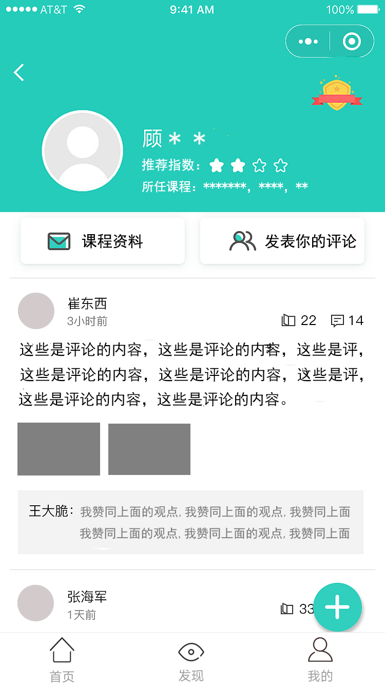
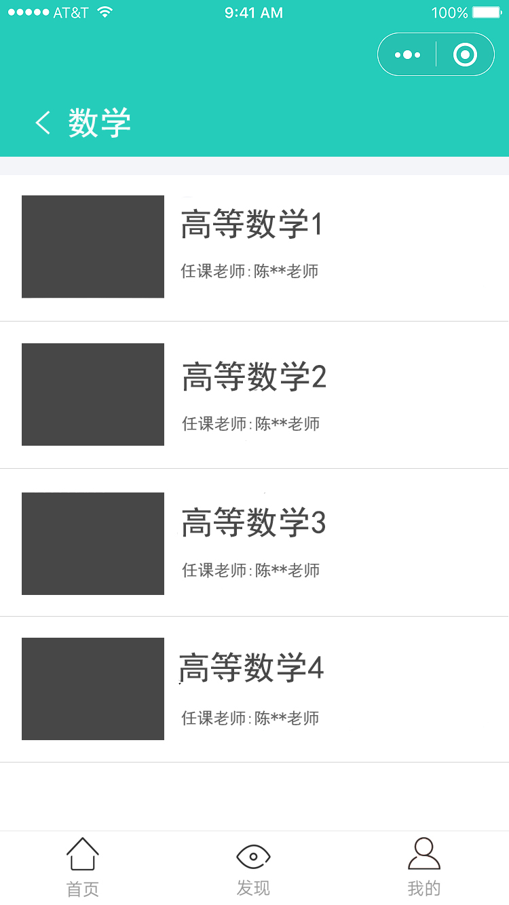
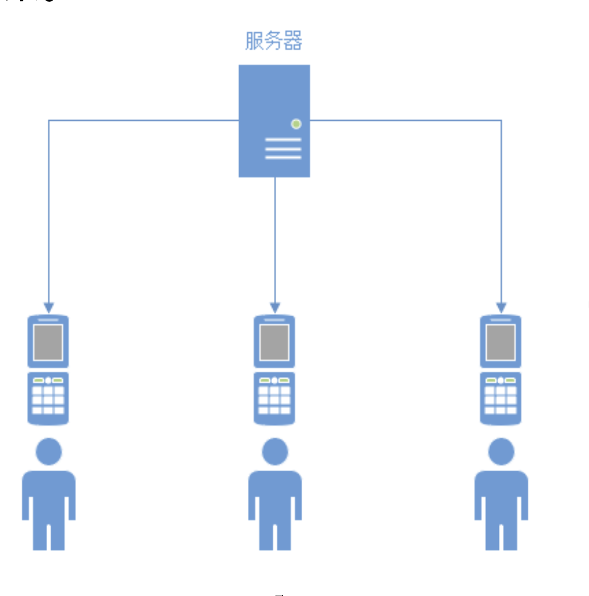

 # “课程评论”APP产品方案设计

## 小组成员：

| 姓名             | 学院        | Github 账号 |
| ---------------- | ----------- | ----------- |
| 杨慧志（小组长） | 20172131036 | Tsumida     |
| 韩昆霖           | 20172121015 | Karl Han    |
| 蔡景彤           | 20172121002 | caijingtong |
| 郑晓芬           | 20173709032 | 123mob      |

目录：

1.  [TOC]

## 背景

​		目前教学存在双向困难：学生不了解教学内容； 老师不了解学生怎么想。

具体表现在：

-   学生选课前后， 对课程的内容、老师教学方式仍然不清楚，这部分的信息目前仅
     靠“口口相传”的方式获取。 课程繁多， 不可能逐个问。 获得方式不具有一般性（从学长学姐处）， 而且获取的信息模糊且不稳定（时间久了， 忘记了细节）。
-   此外， 同学之间流传着少量自行整理的文档（以 docx、 excel 文件为主）， 这在一定程度上记录了的课程信息。但是它们仍面临着更新不方便（手动更新后上传文件）、文件丢失等困难。
-   目前学者网和砺儒云课堂的课程信息、教学资源局限在课程中， 未选课的同学不能访问。
-   教学资源获取方式单一， 主要是通过 U 盘复制、 在学者网或砺儒云课堂下载课
     件。 且受到教学进度的限制。
     对课程（包括必修、选修、非正式课程）进行评论和反馈， 教师也可得到益处。
     学者网、 砺儒云课堂的账号与学生个人信息绑定， 学生不方便作出评论。 
-   通过文档记录、集中存储这些信息， 有利于回溯和追踪。

##产品功能

​        产品中用户分为普通用户和管理员两种角色。管理员也具有普通用户的全部权限， 此外还增加了对内容的管理权限。

## 普通用户角度

1.  用户登陆账号。
2.  用户通过筛选、搜索等方式获得课程列表。
3.  用户查看课程内容及其评论。
4.  用户创建新的课程，分享资料。新课程将对所有用户可见。
5.  用户对该课程发表评论，或修改
6.  用户可查看浏览历史来重新找到课程。
7.  用户可通过“我的评论”来查看自己发表的评论， 并可通过该评论跳转到对应的课程页面。
8.  用户收藏课程。

### 用户功能

​		个人中心：用户可以修改个人信息。

​		查找课程：用户通过筛选、搜索等方式获得课程列表，并进入某一个课程， 查看其内容、发表评论。

​		我的收藏：参看用户收藏的课程。

​		我的评价：按时间降序排列， 记录用户发表的记录。可通过点击查看评论、跳转到对应的课程页面。

## 管理员角度

1.  管理员可以删除不恰当的评论、并且附上删除理由。
2.  管理员可以参看删除历史。
3.  管理员可隐藏评论。

## 可行性分析

### 定位

​	**目标用户**：华南师范大学学生

​	**潜在用户**： 教师

​	**可能用户规模**： 华师全校学生

​		本产品的主要目标就是解决华师学生选课遇到的困难。

​		学生可在本产品上获取感兴趣的课程的信息， 了解课程内容。

​		本课程可以促进课程信息的交流，帮助华师学生规划未来。

​		由于每学期进行一次选课， 预计**用户访问将呈现一定规律**：

​		平时访问量相对较少， 临近选课时访问量将不断上升，两次选课期间将保持高峰， 选课结束后访问量将下降。	

## 市场分析与自身优势

1.  对于学生来说，选课是较为重要的活动。选课结果的影响至少持续一个学期，因此有用的课程信息， 有助于学生对未来的规划。
2.  正如背景所指出， 目前课程资料稀少、分散， 一个集中管理、文档化存储的平台能极大方便学生获取这些信息。
3.  虽然本平台的目的是更好地帮助华师学生选课， 但并没有针对华师这一特定环境进行专门设计，任何一所学校都可以使用。

## 竞争对手和同类产品

### 竞争对手

​		可能的竞争对手有：百度贴吧、QQ群、微信群。

​		原因：百度贴吧、交流群等平台的活跃度不可小觑， 信息的交换也比较频繁， 用户粘性较大。

### 同类产品

​		课程评论一般依与某些课程平台捆绑， 市面上目前没有专门为课程评论而设计的APP。

## 技术解决方案

​		本产品采用JAVA 作为开发语言、Android Studio作为开发平台。

​		本产品采用C/S体系， 数据存储在云服务器上。android客户端通过网络与服务器通信。客户端可缓存部分数据， 以减少网络通信。

​		从技术上看，本产品最为重要的功能是查找课程（筛选、搜索）和评价（查看、发表），这些都有成熟的解决方案。

## 推广方案

​		如何推广本产品？

​				主要通过目线上推广。目前，QQ群、微信群、朋友圈相当活跃，可以借助这些平台进行宣传。

## 运营规划书

​		本产品是向华师全校学生开放的公共服务平台， 不打算进行商业化。

​		本产品需要若干同学担任管理员， 负责日常管理工作。

​		另外本产品需要一名管理员定期进行数据备份、维护工作。

​		本产品将采用迭代式开发， 所以会定期推出新版本。

​	